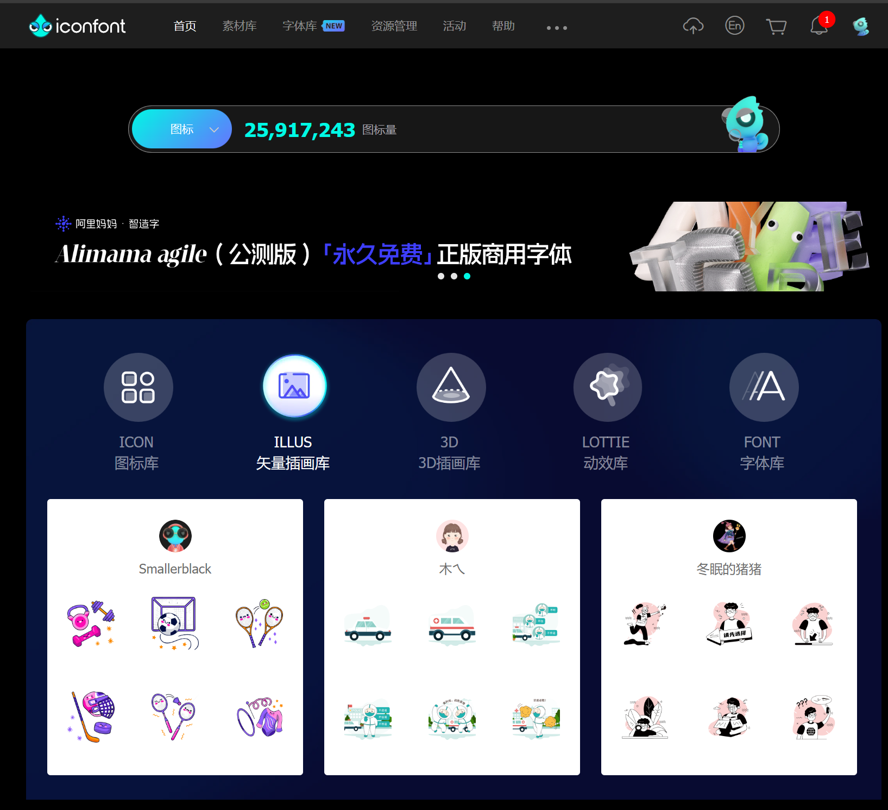
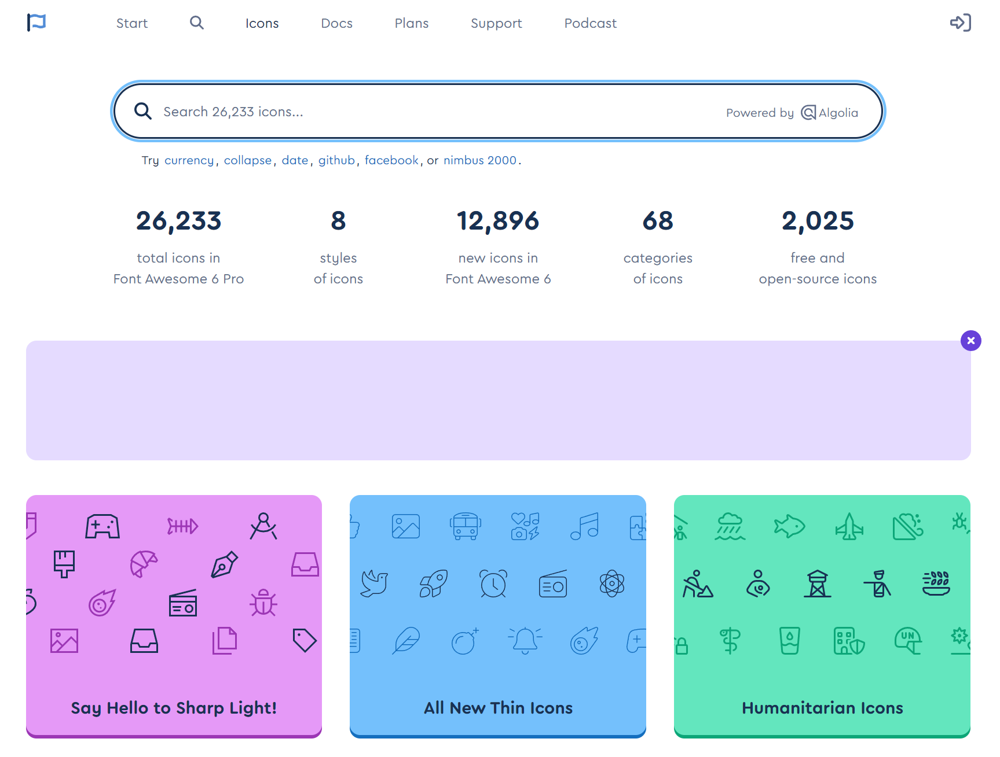
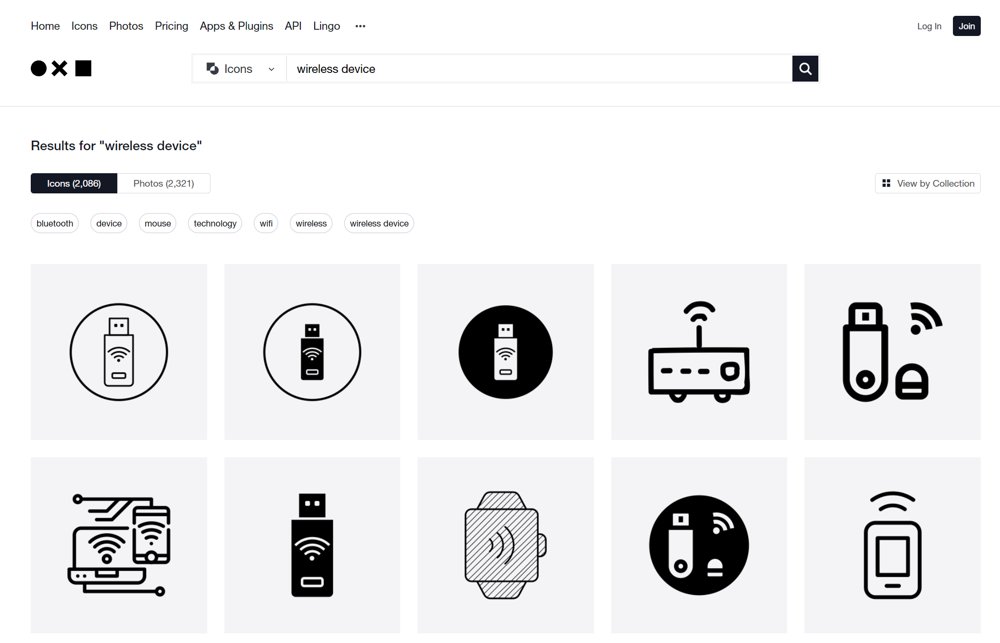
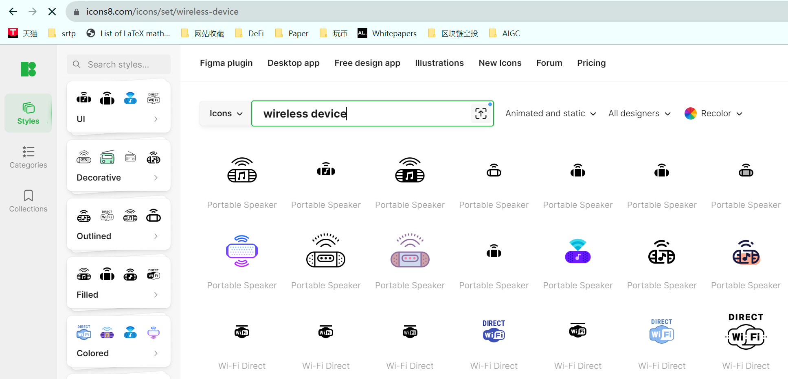
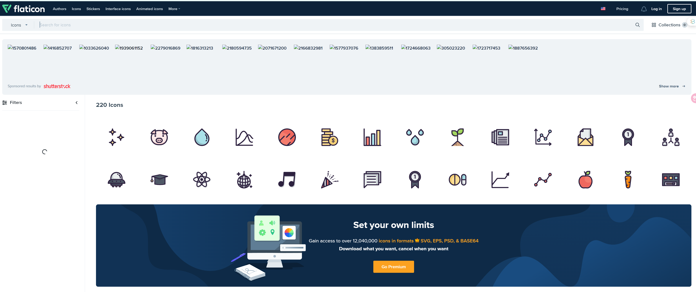
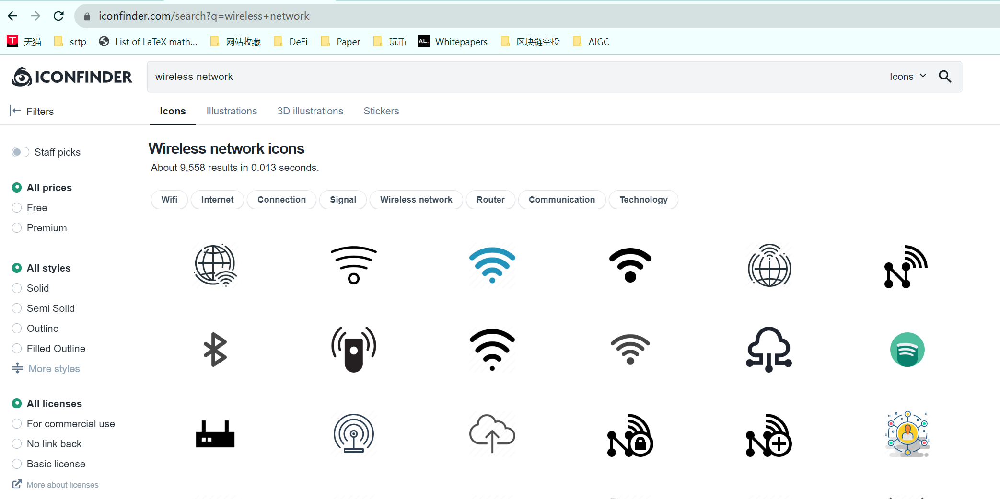
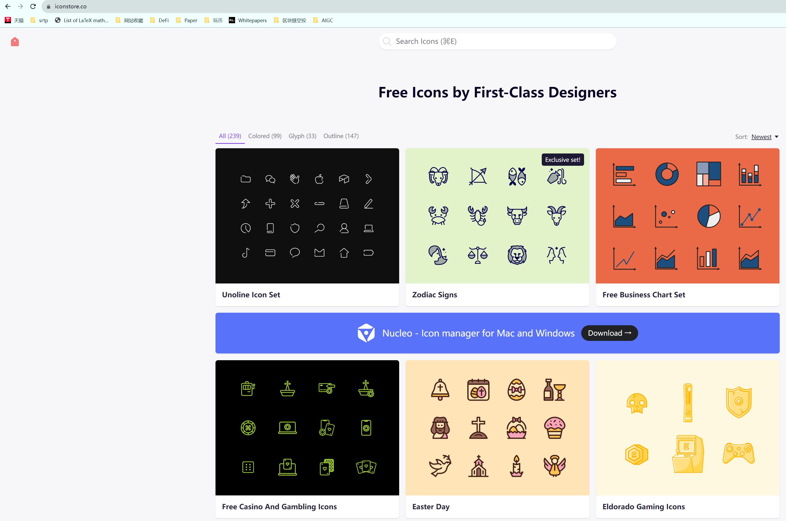
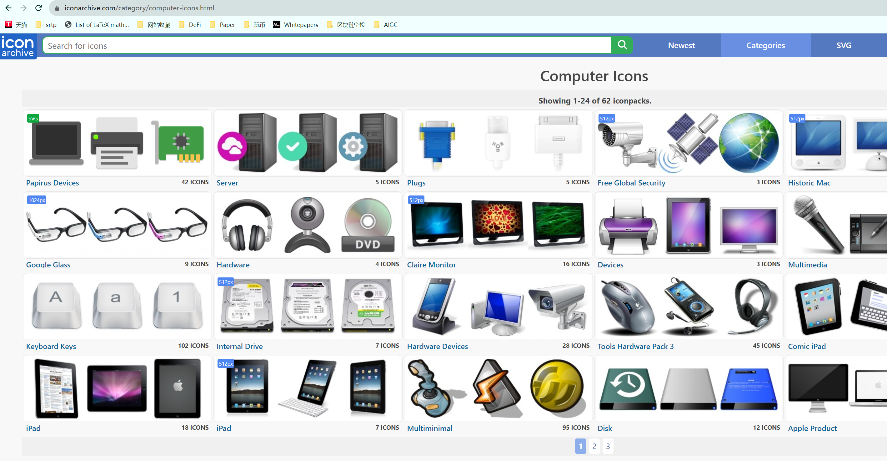

# Icon
Open source, free icon material library that can be used for scientific drawing.

## 1. https://www.iconfont.cn/

## 2. https://fontawesome.com/icons

## 3. https://thenounproject.com/search/icons

## 4. https://icons8.com/icons/set/linear-icons

## 5. https://www.flaticon.com/search?style_id=69

## 6. https://www.iconfinder.com

## 7. https://iconstore.co/

## 8. https://www.iconarchive.com

